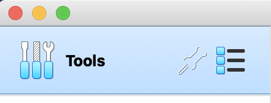
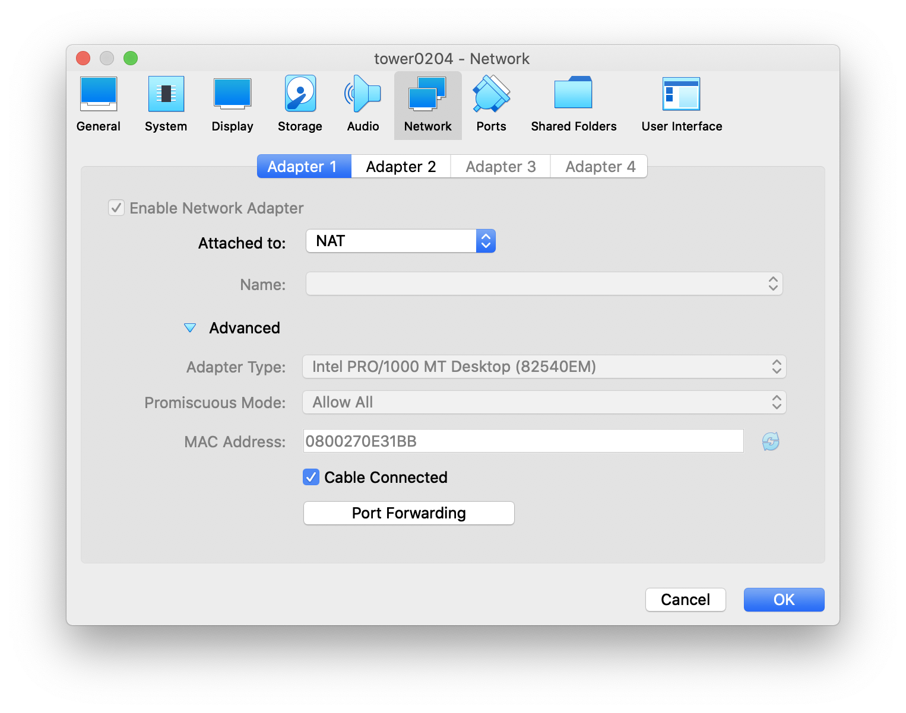
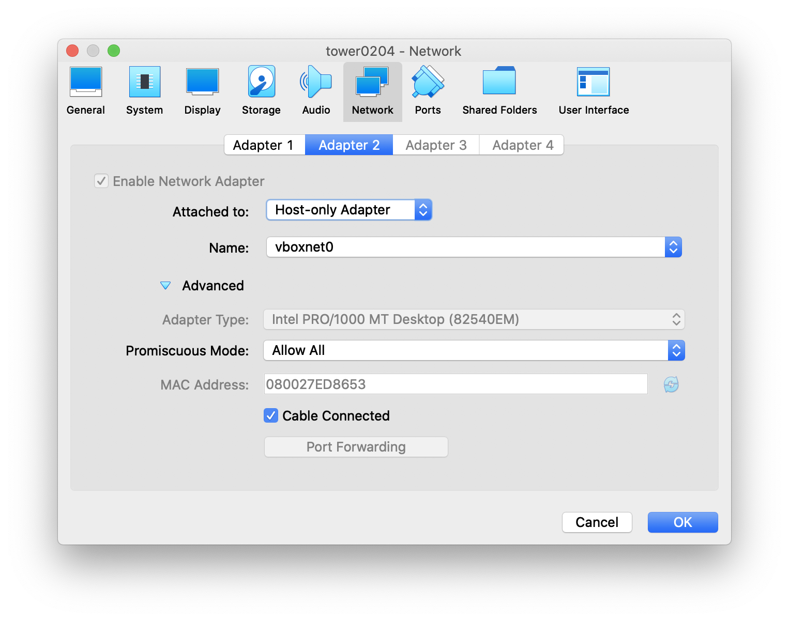

## Virtualbox: Setting up Networking when Bridged Does Not Allocate DHCP ipv4 addresses

1\. Start VirtualBox

2\. Shutdown any running servers

3\. Click on the List (next to the Pin) and click on Settings



4\. Hit Create

5\. For vboxnet0, check DHCP. #Note: I still never got DHCP working on this.

6\. **VM > Settings > Network > Adapter 1 > NAT**

​       **… Advanced > Promiscuous Mode > Allow all**

>​       \**#Tip: If this is greyed out, you might need to switch out Attached to: either NAT or NAT Network to click it off Deny**



7\. **VM > Settings > Network > Adapter 2 > Host only**



8\. Start Detached Mode

9\. Login as root

10\. Edit `/etc/sysconfig/network-script/ifcfg-eth1 #whatever your second adapter might be -- YMMV`

```
[root@tower0204 network-scripts]# cat ifcfg-enp0s8
TYPE="Ethernet"
PROXY_METHOD="none"
BROWSER_ONLY="no"
BOOTPROTO="none"
IPADDR=192.168.56.10
PREFIX=24
GATEWAY=192.168.56.1
DEFROUTE="yes"
IPV4_FAILURE_FATAL="no"
IPV6INIT=no
NAME="enp0s8"
UUID="14f7fbe0-0aae-4a72-b881-e5301127558b"
DEVICE="enp0s8"
ONBOOT="yes"
```

11\. Restart network services
```
[root@tower0204 network-scripts]# cat ifcfg-enp0s8
TYPE="Ethernet"
PROXY_METHOD="none"
BROWSER_ONLY="no"
BOOTPROTO="none"
IPADDR=192.168.56.10
PREFIX=24
GATEWAY=192.168.56.1
DEFROUTE="yes"
IPV4_FAILURE_FATAL="no"
IPV6INIT=no
NAME="enp0s8"
UUID="14f7fbe0-0aae-4a72-b881-e5301127558b"
DEVICE="enp0s8"
ONBOOT="yes"
```

------

## VirtualBox: "VBoxNetAdpCtl: Error while adding new interface: failed to open /dev/vboxnetctl: No such file or directory."

Error:
VBoxNetAdpCtl: Error while adding new interface: failed to open /dev/vboxnetctl: No such file or directory.

Solution:
sudo launchctl load /Library/LaunchDaemons/org.virtualbox.startup.plist

Source:
https://stackoverflow.com/questions/18149546/vagrant-up-failed-dev-vboxnetctl-no-such-file-or-directory


------

##


------

##


------

##


------

